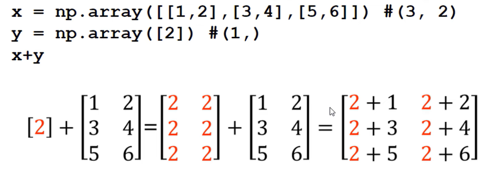

# 5. Broadcasting


Solve the problem of calculating arrays with different dimensions. <br>

Boadcast Array that smaller was duplicated. <br>
Ex. array x 2 dim, array y 2 dim. -> array y 1 dim was boardcasted to array 2 dim to align with array x, compare dimensions from right to left.

!

``` python
import numpy as np

a = np.array([1,2,3,4,5,6])
b = np.array([1,2])
# a+b -> ValueError: operands could not be broadcast together with shapes (6,) (2,) 
x = np.array([[1,2], [3,4], [5,6]])
y = np.array([1,2,3])
# x+y -> ValueError: operands could not be broadcast together with shapes (3,2) (3,) 
x1 = np.array([[1,2], [3,4], [5,6]])
y1 = np.array([1,2]) # -> มันจะทำงานซ้ำ เป็น np.array([[1,2], [1,2], [1,2]])
print(x1+y1)
```
<details>
<summary> Output </summary>

``` python
# [[2 4]
#  [4 6]
#  [6 8]]
```
</details>

