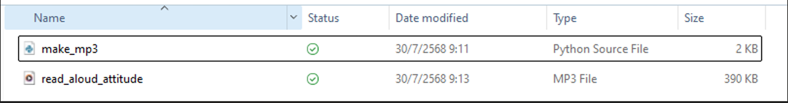

# Voice

ขั้นตอนการทำไฟล์เสียงอ่าน
1. ติดตั้ง ```gTTs```
    ``` md
    pip install gtts 
    ```

<details style= "margin-bottom: 10px;">
<summary> 2. สร้าง python ไฟล์ [make_mp3.py] >> จากนั้น run python </summary>

``` python
from gtts import gTTS

text_en = """In August, a famous author was invited to give a special talk 
about how having a positive attitude can attract success and happiness in life. 
The event was held at a beautiful park during autumn, 
where the colorful leaves created a warm and inspiring atmosphere. 
The audience listened carefully and took notes 
as the speaker shared practical tips and inspiring stories.

One of the main attractions at the event 
was a small exhibition of rare books written by different authors, 
which many people found very attractive. 
My aunt, who works for the local authority, 
helped organize the exhibition and made sure everything was well-prepared. 
Thanks to her and the organizers, 
the event became a memorable experience for everyone.
"""

# สร้างไฟล์เสียง mp3
tts = gTTS(text=text_en, lang='en')
tts.save("read_aloud_attitude.mp3")
print("สร้างไฟล์เสียงเรียบร้อย: read_aloud_attitude.mp3")
```
</details>

3. จะได้ไฟล์ read_aloud_attitude.mp3 สามารถเปิดฟังได้เลย <br>


