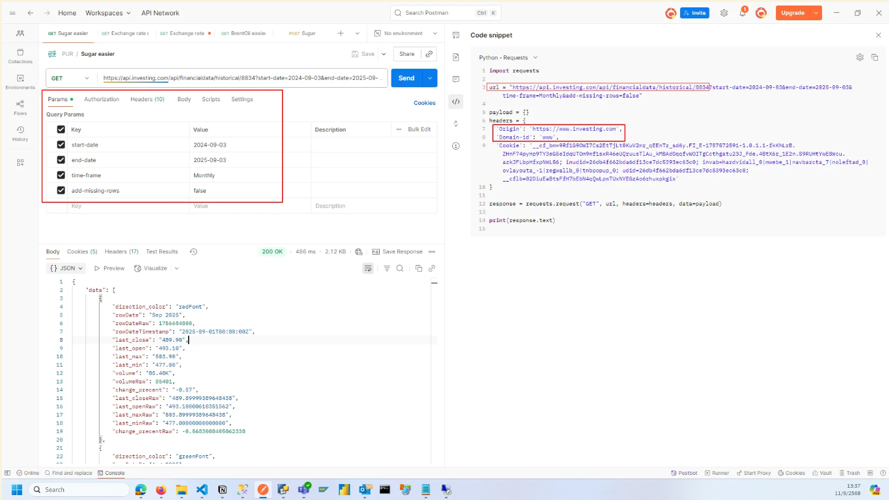
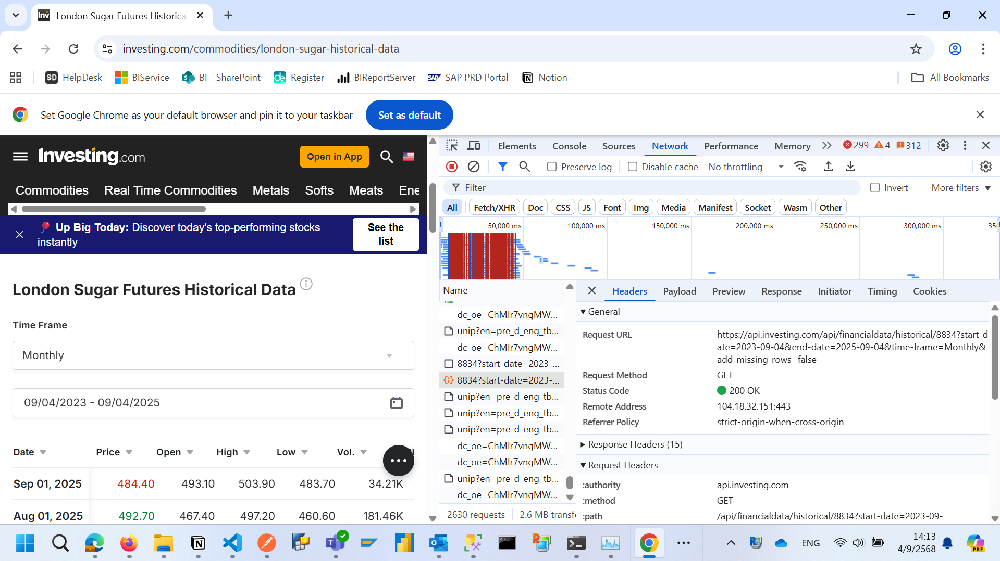
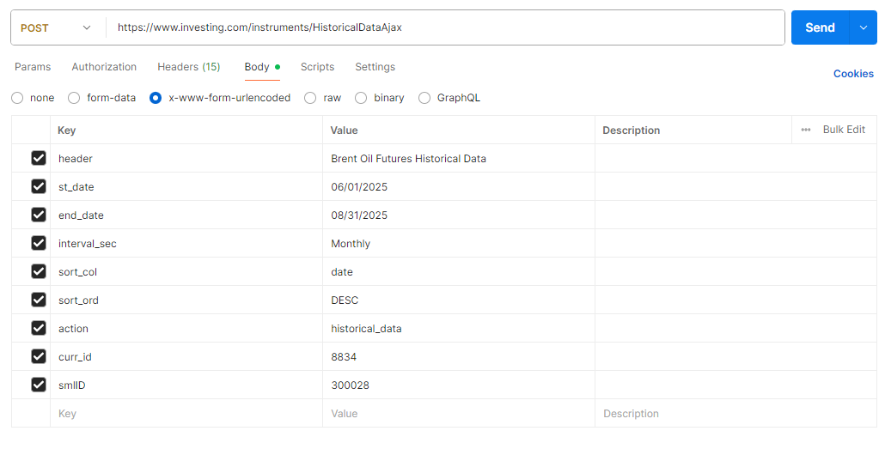
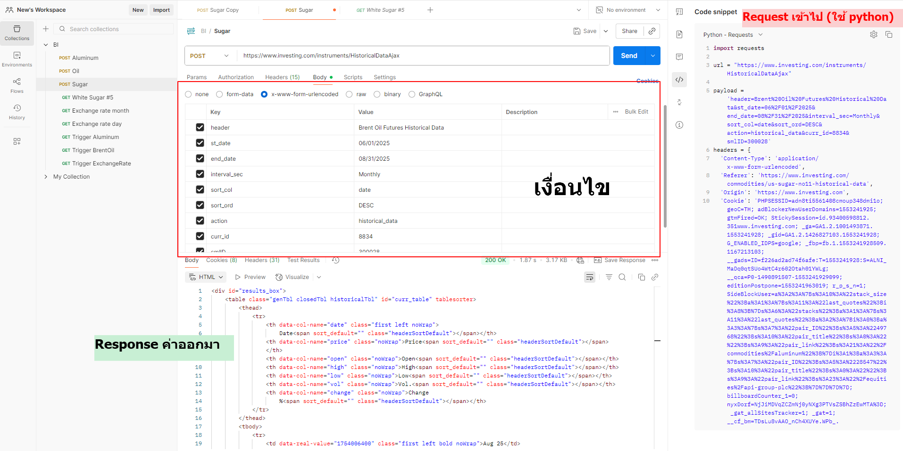
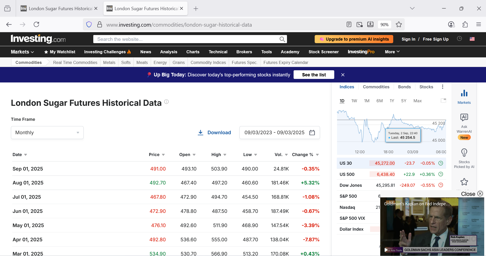
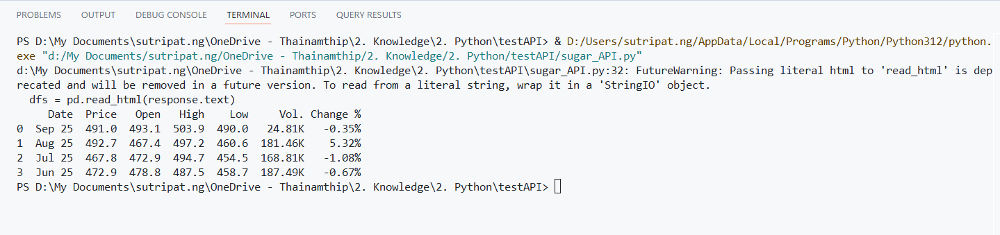

# Extract Data from WEB

<details>
<summary> ดึงข้อมูลจาก WEB </summary>

``` python
# ------------------------------------------- Step 2.1 : Query Data from WEB -------------------------------------------
import cloudscraper
import pandas as pd
from datetime import datetime
from dateutil.relativedelta import relativedelta

# วันที่ 1 ของเดือนปัจจุบัน - 3
today = datetime.today()
st_date = (datetime(today.year, today.month, 1) - relativedelta(months=3)).strftime("%Y-%m-%d")

# วันที่ สิ้นเดือนของเดือนที่แล้ว
end_date = (datetime(today.year, today.month, 1) - relativedelta(days=1)).strftime("%Y-%m-%d")


url = "https://api.investing.com/api/financialdata/historical/8834"

payload = {}

parameter = {
    'start-date': st_date,
    'end-date': end_date,
    # 'time-frame': 'Monthly',
    'time-frame': 'Daily',
    'add-missing-rows' : False    
}

headers = {
    'Origin': 'https://www.investing.com',
    'Domain-id': 'www'
    # 'X-Requested-With': 'XMLHttpRequest'
    # 'Referer': 'https://www.investing.com/commodities/london-sugar-historical-data'
}

scraper = cloudscraper.create_scraper()
response = scraper.get(url, headers=headers, params=parameter)

# แปลง JSON Table เป็น DataFrame
dfs = response.json()
df = pd.DataFrame(dfs["data"])[["rowDate", "last_close"]]
```
</details>


<details style="margin-bottom: 15px">
<summary> เชคจาก API </summary>


</details>

---

สามารถดูตัวอย่างการดึงข้อมูลจาก WEB ได้

<details style="margin-bottom: 10px; margin-left: 1em;">
<summary> ตัวอย่าง การดึงข้อมูลจากเว็บ </summary>

เรามี Postman ดังนี้
> path : <a href= "[https://www.investing.com/instruments/HistoricalDataAjax](https://www.investing.com/instruments/HistoricalDataAjax)"> [https://www.investing.com/instruments/HistoricalDataAjax](https://www.investing.com/instruments/HistoricalDataAjax) </a>






<div style="display: flex; gap: 10px;">

  <div style="width: 45%;">
  
### Code request
``` python
import requests

url = "https://www.investing.com/instruments/HistoricalDataAjax"

payload = 'header=Brent%20Oil%20Futures%20Historical%20Data&st_date=06%2F01%2F2025&end_date=08%2F31%2F2025&interval_sec=Monthly&sort_col=date&sort_ord=DESC&action=historical_data&curr_id=8834&smlID=300028'
headers = {
'Content-Type': 'application/x-www-form-urlencoded',
'Referer': 'https://www.investing.com/commodities/us-sugar-no11-historical-data',
'Origin': 'https://www.investing.com',
'Cookie': 'PHPSESSID=adn8ti5561408cmoup348dmi1o; geoC=TH; adBlockerNewUserDomains=1553241925; gtmFired=OK; StickySession=id.93400598812.351www.investing.com; _ga=GA1.2.1001493871.1553241928; _gid=GA1.2.1426827103.1553241928; G_ENABLED_IDPS=google; _fbp=fb.1.1553241928509.1167213103; __gads=ID=f226ad2ad74f6afe:T=1553241928:S=ALNI_MaDq0qtSUo4WtC4r602Otah01YWLg; __qca=P0-1490891507-1553241929099; editionPostpone=1553241963019; r_p_s_n=1; SideBlockUser=a%3A2%3A%7Bs%3A10%3A%22stack_size%22%3Ba%3A1%3A%7Bs%3A11%3A%22last_quotes%22%3Bi%3A8%3B%7Ds%3A6%3A%22stacks%22%3Ba%3A1%3A%7Bs%3A11%3A%22last_quotes%22%3Ba%3A2%3A%7Bi%3A0%3Ba%3A3%3A%7Bs%3A7%3A%22pair_ID%22%3Bs%3A5%3A%2249768%22%3Bs%3A10%3A%22pair_title%22%3Bs%3A0%3A%22%22%3Bs%3A9%3A%22pair_link%22%3Bs%3A21%3A%22%2Fcommodities%2Faluminum%22%3B%7Di%3A1%3Ba%3A3%3A%7Bs%3A7%3A%22pair_ID%22%3Bs%3A5%3A%2228547%22%3Bs%3A10%3A%22pair_title%22%3Bs%3A0%3A%22%22%3Bs%3A9%3A%22pair_link%22%3Bs%3A23%3A%22%2Fequities%2Fapi-group-plc%22%3B%7D%7D%7D%7D; billboardCounter_1=0; nyxDorf=NjJiMDVqZCZmNj0yNXg3PTVsZSBhZzEwMTA%3D; _gat_allSitesTracker=1; _gat=1; __cf_bm=TDsLu8vAAO_nCh4XUYe.WPb_.r9qXGZ2ioO4SZHFTYE-1756888235-1.0.1.1-wlCB5GxWgMf6Z0TlACgvwaJQTilb8HNDWbcNo4eWMi7XoBZmkn19Sdaaj4BI5BNac_Djaec9WIHmNQ8LSnyw7dPun5Yq.GBAMOC_xQ78Pq6g8oTyORhFQMlk0RPLSdGH; firstUdid=0; inudid=26db4f662bda6df13ce7dc5393ec63c0; invab=hardvidall_0|mwebe_1|navbarcta_7|noleftad_0|ovlayouta_-1|regwallb_0|tnbpopup_0; smd=26db4f662bda6df13ce7dc5393ec63c0-1756888234; udid=26db4f662bda6df13ce7dc5393ec63c0; PHPSESSID=adn8ti5561408cmoup348dmi1o; __cflb=02DiuGRugds2TUWHMkimYPAcC3JQrXKkBEVWLACA2JKyv',
'X-Requested-With': 'XMLHttpRequest'
}

response = requests.request("POST", url, headers=headers, data=payload)

print(response.text)
```
  
  </div>


  <div style="width: 50%;">
  
  ### VSCode ใน python ⇒ copy code จาก request บางส่วน

``` python
import cloudscraper
import pandas as pd

url = "https://www.investing.com/instruments/HistoricalDataAjax"

payload = {
    'header': 'London Sugar Futures Historical Data',
    'st_date': '06/01/2025',
    'end_date': '09/30/2025',
    'interval_sec': 'Monthly',
    'sort_col': 'date',
    'sort_ord': 'DESC',
    'action': 'historical_data',
    'curr_id': '8834',
    'smlID': '300028'
}

headers = {
    'Content-Type': 'application/x-www-form-urlencoded',
    'User-Agent': 'Mozilla/5.0',
    'X-Requested-With': 'XMLHttpRequest',
    'Referer': 'https://www.investing.com/commodities/london-sugar-historical-data'
}


scraper = cloudscraper.create_scraper()
# response = scraper.post(url, data=payload)
response = scraper.post(url, headers=headers, data=payload)

# แปลง HTML Table เป็น DataFrame
dfs = pd.read_html(response.text)
df = dfs[0]

print(df)
```

<details>
<summary> หรือใช้ Code นี้ </summary>

``` python
import cloudscraper
import pandas as pd
from datetime import datetime
from dateutil.relativedelta import relativedelta

# วันที่ 1 ของเดือนปัจจุบัน - 3
today = datetime.today()
st_date = datetime(today.year, today.month-3, 1).strftime("%Y-%m-%d")

# วันที่ สิ้นเดือนของเดือนที่แล้ว
end_date = (datetime(today.year, today.month, 1) - relativedelta(days=1)).strftime("%Y-%m-%d")


url = "https://api.investing.com/api/financialdata/historical/8834"

payload = {}

parameter = {
    'start-date': st_date,
    'end-date': end_date,
    'time-frame': 'Monthly',
    'add-missing-rows' : False    
}

headers = {
    'Origin': 'https://www.investing.com',
    'Domain-id': 'www'
    # 'X-Requested-With': 'XMLHttpRequest'
    # 'Referer': 'https://www.investing.com/commodities/london-sugar-historical-data'
}

scraper = cloudscraper.create_scraper()
response = scraper.get(url, headers=headers, params=parameter)


# แปลง HTML Table เป็น DataFrame
dfs = response.json()

df = pd.DataFrame(dfs["data"])[["rowDate", "last_close"]]
# print(df)


# ------------------------------------------------------------ ETL DATA ------------------------------------------------------------
# แปลง Date เป็น datetime
df['Date_parsed'] = pd.to_datetime(df['rowDate'], format='%b %Y')

# สร้างคอลัมน์ Year , Month และ UPDATE DATE 
df['YEAR'] = df['Date_parsed'].dt.year
df['MONTH'] = df['Date_parsed'].dt.month
df['UPDATE DATE'] = pd.Timestamp.now()

# เปลี่ยนชื่อ
df = df.rename(columns={'last_close': 'PRICE'})

# # ลบคอลัมน์ช่วยเหลือถ้าไม่ต้องการ
df = df.drop(columns=['Date_parsed'])


# เลือกคอลัมน์ที่ 1 และ 2 (index 0 และ 1) และเรียงคอลัมน์
df_result = df.iloc[:, [-3,-2, 1, -1]]
df_result = df_result.sort_values(by=['YEAR', 'MONTH'], ascending=[True, True])

print(df_result)

# df_result.to_csv("sugar_result.csv")
```
</details>


  </div>

</div>


<div style="display: flex; gap: 20px;">
<div style="width: 50%">

- ผลลัพธ์หน้าเว็บ  

</div>
<div style="width: 50%">

- ผลลัพธ์ VSCode  

</div>

</div>

<details style="margin-left: 2em;">
<summary> คำอธิบาย Code จาก VSCode </summary>

1. Import ไลบรารี
    ``` python
    import cloudscraper
    import pandas as pd
    ```
- `cloudscraper` → เป็นไลบรารีที่ช่วยส่ง HTTP request ผ่านเว็บไซต์ที่มี **Cloudflare** ป้องกัน bot หรือ bot-check
- `pandas` → ใช้สำหรับจัดการข้อมูลในรูปแบบ **DataFrame** ซึ่งง่ายต่อการวิเคราะห์และแปลงข้อมูลจากตาราง HTML

2. กำหนด URL  
    ```bash 
    url = "https://www.investing.com/instruments/HistoricalDataAjax"
    ```
    - นี่คือ URL ของ **AJAX endpoint** ของ Investing.com สำหรับดึงข้อมูลราคาย้อนหลังของสินค้า (commodity)
    - AJAX endpoint จะไม่ใช่หน้าเว็บปกติ แต่จะคืน **HTML ของตาราง** หรือ JSON ข้อมูลแทน

3. สร้าง payload (ข้อมูลที่จะส่งไปกับ POST)  
    ```python 
    payload = {
    'header': 'London Sugar Futures Historical Data',
    'st_date': '06/01/2025',
    'end_date': '09/30/2025',
    'interval_sec': 'Monthly',
    'sort_col': 'date',
    'sort_ord': 'DESC',
    'action': 'historical_data',
    'curr_id': '8834',
    'smlID': '300028'
    }
    ```

    - `st_date` และ `end_date` → กำหนดช่วงวันที่ที่เราต้องการดึงข้อมูล
    - `interval_sec` → ความถี่ข้อมูล เช่น `Daily`, `Weekly`, `Monthly`
    - `sort_col` → คอลัมน์ที่จะใช้เรียงข้อมูล (`date`)
    - `sort_ord` → ลำดับการเรียง (`ASC` ขึ้น, `DESC` ลง)
    - `curr_id` และ `smlID` → รหัสสินค้าที่กำหนดโดย Investing.com
    - `action` → บอก endpoint ว่าเราต้องการ **historical_data**

    > สรุป: payload คือข้อมูลทั้งหมดที่เว็บไซต์คาดหวังเพื่อดึงตารางราคาย้อนหลัง

4. กำหนด headers
    ```python 
    headers = {
        'Content-Type': 'application/x-www-form-urlencoded',
        'User-Agent': 'Mozilla/5.0',
        'X-Requested-With': 'XMLHttpRequest',
        'Referer': 'https://www.investing.com/commodities/london-sugar-historical-data'
    }
    ```
    - `Content-Type` → บอก server ว่าเราส่งข้อมูลแบบ form
    - `User-Agent` → บอกว่า request มาจาก browser (สำคัญเพราะหลายเว็บบล็อก bot)
    - `X-Requested-With: XMLHttpRequest` → บอกว่าเป็น **AJAX request**
    - `Referer` → บอกว่า request มาจากหน้าเว็บนั้นจริง

    > ทำไมต้อง headers: เพราะ Investing.com ตรวจสอบ bot ถ้าไม่มี headers อาจโดน block

5. สร้าง scraper และส่ง POST request
    ```python 
    scraper = cloudscraper.create_scraper()
    response = scraper.post(url, headers=headers, data=payload)
    ```
    - `cloudscraper.create_scraper()` → สร้าง session ที่สามารถผ่าน Cloudflare protection
    - `scraper.post(...)` → ส่ง request แบบ **POST** ไปยัง endpoint พร้อม payload และ headers
    > ตอนนี้ response.text จะมี HTML ของตารางราคาย้อนหลัง

6. แปลง HTML table เป็น DataFrame
    ```python
    dfs = pd.read_html(response.text)
    df = dfs[0]
    ```
    - `pd.read_html()` → Pandas อ่าน HTML แล้วแปลงเป็น **DataFrame**
    - เพราะหน้า AJAX อาจมีหลาย table → เลือก table แรกด้วย `dfs[0]`

7. แสดงผล
    ```python
    print(df)
    ```
    - แสดงตารางราคาย้อนหลังใน console
    - เราสามารถเอา DataFrame นี้ไปทำงานต่อ เช่น วิเคราะห์ หรือบันทึกเป็น Excel/CSV    

</details>
</details>

ตัวอย่างการ ดึงข้อมูล MSSQL + ดึงข้อมูลจากเว็บ → รวมข้อมูลและ Export ลง MSSQL
<details style="margin-bottom: 1px; margin-left: 1em;">
<summary> ตัวอย่าง Code </summary>

``` python
# ------------------------------- Step 1 : Query MsSQL and DELETE Historical data 3 months -------------------------------

from sqlalchemy import create_engine, text, DECIMAL
import pyodbc
import pandas as pd
import urllib

# ตั้งค่า connection
# conn = pyodbc.connect(
#     "DRIVER={ODBC Driver 17 for SQL Server};"
#     "SERVER=TDWPOWERBI;"   # หรือใส่ IP เช่น 10.1.1.89
#     "DATABASE=TNTL_PUR;"
#     "UID=tntlbiadmin;"             # SQL Login user
#     "PWD=admin@123;"  # รหัสผ่าน
# )

params = urllib.parse.quote_plus(
    "DRIVER={ODBC Driver 17 for SQL Server};"
    "SERVER=TDWPOWERBI;"   
    "DATABASE=TNTL_PUR;"
    "UID=tntlbiadmin;"             # SQL Login user
    "PWD=admin@123;"  # รหัสผ่าน
)
engine = create_engine(f"mssql+pyodbc:///?odbc_connect={params}")


# คำสั่ง SQL ลบข้อมูล 3 เดือนย้อนหลัง
delete_query = """
    DELETE FROM dbo.STG_Sugar 
    WHERE DATEFROMPARTS([YEAR], [MONTH], 1) >= DATEADD(MONTH, -3, DATEFROMPARTS(YEAR(GETDATE()), MONTH(GETDATE()), 1))
    """
# รันคำสั่ง
with engine.begin() as conn:
    conn.execute(text(delete_query))


# เขียน SQL Query
sql_query = """
    SELECT * 
    FROM dbo.STG_Sugar
    """

# แสดงผลลัพธ์
df_ORG = pd.read_sql(sql_query, engine)

# ------------------------------------------- Step 2.1 : Query Data from WEB -------------------------------------------
import cloudscraper
import pandas as pd
from datetime import datetime
from dateutil.relativedelta import relativedelta

# วันที่ 1 ของเดือนปัจจุบัน - 3
today = datetime.today()
st_date = (datetime(today.year, today.month, 1) - relativedelta(months=3)).strftime("%Y-%m-%d")

# วันที่ สิ้นเดือนของเดือนที่แล้ว
end_date = (datetime(today.year, today.month, 1) - relativedelta(days=1)).strftime("%Y-%m-%d")


url = "https://api.investing.com/api/financialdata/historical/8834"

payload = {}

parameter = {
    'start-date': st_date,
    'end-date': end_date,
    # 'time-frame': 'Monthly',
    'time-frame': 'Daily',
    'add-missing-rows' : False    
}

headers = {
    'Origin': 'https://www.investing.com',
    'Domain-id': 'www'
    # 'X-Requested-With': 'XMLHttpRequest'
    # 'Referer': 'https://www.investing.com/commodities/london-sugar-historical-data'
}

scraper = cloudscraper.create_scraper()
response = scraper.get(url, headers=headers, params=parameter)

# แปลง JSON Table เป็น DataFrame
dfs = response.json()
df = pd.DataFrame(dfs["data"])[["rowDate", "last_close"]]


# ------------------------------------------------ STEP 2.2  ETL DATA ------------------------------------------------
from decimal import Decimal, ROUND_HALF_UP

# แปลง Date เป็น datetime
df["rowDate"] = pd.to_datetime(df["rowDate"])

# สร้างคอลัมน์ Year , Month และ UPDATE DATE 
df['YEAR'] = df['rowDate'].dt.year
df['MONTH'] = df['rowDate'].dt.month
df['UPDATE DATE'] = pd.Timestamp.now()

# เปลี่ยนชื่อ
df = df.rename(columns={'last_close': 'PRICE'})


# เลือกคอลัมน์ที่ 1 และ 2 (index 0 และ 1) และเรียงคอลัมน์
df_result = df.iloc[:, [-3,-2, 1, -1]]
df_result = df_result.sort_values(by=['YEAR', 'MONTH'], ascending=[True, True])

# เปลี่ยนชนิดข้อมูล PRICE จาก Str => float
df_result["PRICE"] = df_result["PRICE"].astype(float)

# group by YEAR MONTH => แล้วหา AVG
df_result = df_result.groupby(["YEAR", "MONTH","UPDATE DATE"])["PRICE"].mean().reset_index().round(2)

# แปลงเป็น Decimal(18,2)
df_ORG["PRICE"] = df_ORG["PRICE"].apply(
    lambda x: Decimal(x).quantize(Decimal("0.00"), rounding=ROUND_HALF_UP)
)
df_result["PRICE"] = df_result["PRICE"].apply(
    lambda x: Decimal(x).quantize(Decimal("0.00"), rounding=ROUND_HALF_UP)
)


df_all = pd.concat([df_ORG, df_result], axis=0)


# print(type(df_all["PRICE"].iloc[0]))
# print(df_result)

# ------------------------------------------------ STEP 3  UPDATE STG_SUGAR ------------------------------------------------
# df_result.to_csv("sugar_result.csv")
df_all.to_sql('STG_Sugar', engine, if_exists='replace', index=False, dtype={"PRICE": DECIMAL(18, 2)})	# append
print("--- Data loaded to SQL Completed ---")
```
</details>

ตัวอย่างการ ดึงข้อมูลจาก Excel → transform → Load ของ MSSQL
<details style="margin-bottom: 1px; margin-left: 1em;">
<summary> ตัวอย่าง Code </summary>

``` python
# ----------------------------- 1. Connect DATABASE -----------------------------
from sqlalchemy import create_engine, text, DECIMAL
import urllib
import pandas as pd

# ตั้งค่า connection
params = urllib.parse.quote_plus(
    "DRIVER={ODBC Driver 17 for SQL Server};"
    "SERVER=TDWPOWERBI;"   
    "DATABASE=TNTL_TEST;"
    "UID=tntlbiadmin;"             # SQL Login user
    "PWD=admin@123;"  # รหัสผ่าน
)
engine = create_engine(f"mssql+pyodbc:///?odbc_connect={params}")


delete_query = """
    DELETE FROM dbo.FILE_TEST 
    """
# รันคำสั่ง
with engine.begin() as conn:
    conn.execute(text(delete_query))


# เขียน SQL Query
sql_query = """
    SELECT * 
    FROM dbo.FILE_TEST
    """

# แสดงผลลัพธ์
df_ORG = pd.read_sql(sql_query, engine)
display(df_ORG)


# ----------------------------- 2. Extract from Excel & Transform data -----------------------------

import pandas as pd

path_gen = r'D:\My Documents\sutripat.ng\OneDrive - Thainamthip\1. Work\998. GenerateFileTest\file_test{}.xlsx'

all_dfs = []

for i in range(1,5):
    file_path = path_gen.format(i)
    df = pd.read_excel(file_path, engine='openpyxl')
    df['UPDATE DATE'] = pd.Timestamp.now()
    print(f'file ที่นำเข้ามีชื่อว่า file_test{i}.xlsx')
    all_dfs.append(df)  # เก็บแต่ละ df เข้า list
    
final_df = pd.concat(all_dfs, ignore_index=True)
# display(final_df)

# ----------------------------- 3. Load to MSSQL -----------------------------

final_df.to_sql('FILE_TEST', 
              engine, 
              if_exists='append', # append 
              index=False
            )	
print('Export complete')
```
</details>